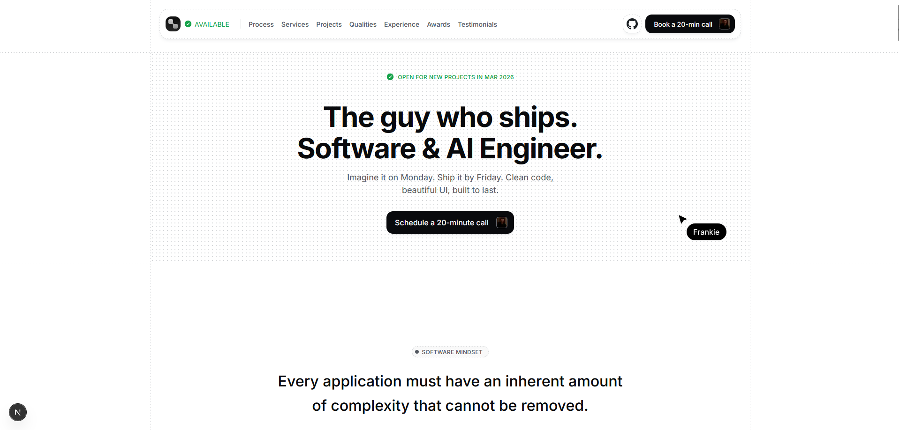

# Frank Mosehla — Portfolio

**Software engineer — ship fast, ship right.**

Personal portfolio and professional site for Nkululeko Frank Mosehla: web and mobile development, AI systems, and product engineering.



---

## Overview

Single-page portfolio built with **Next.js 16** and **React 19**, featuring a clean layout, dotted background sections, custom cursors, dark mode, and a feature-based codebase. Content includes work process, services, projects, qualities, experience, awards, testimonials, and a Cal.com booking section.

---

## Tech stack

| Category      | Stack |
|---------------|--------|
| Framework     | Next.js 16 (App Router) |
| UI            | React 19, Tailwind CSS 4, shadcn/ui (Radix Nova), Radix UI |
| Icons         | Lucide React, developer-icons |
| Fonts         | Inter (sans), Geist Sans, Geist Mono |
| Deployment    | Vercel-ready (metadata, OG, sitemap, robots) |

---

## Project structure

- **`app/`** — Next.js App Router: `layout.tsx`, `page.tsx`, `globals.css`, metadata, SEO.
- **`shared/components/`** — Shared UI: `navbar`, `footer`, `section-chip`, `section-divider`, and `ui/` (shadcn components: button, card, input, etc.).
- **`features/`** — Feature-based sections, each with `components/` and optionally `constants/`:
  - `hero` — Hero with custom cursor and CTA
  - `software-mindset` — Quote (e.g. Larry Tesler)
  - `process` — Work process, tech stack marquee, stack popovers
  - `services` — Engineering services cards
  - `projects` — Selected projects grid
  - `qualities` — Key values / fundamental qualities
  - `experience` — Timeline and resume
  - `awards` — Awards & hackathons with modal
  - `testimonials` — Client quotes
  - `get-started` — Cal.com embed and contact
- **`lib/`** — `site.ts` (SEO/metadata config), `utils.ts` (e.g. `cn`).
- **`public/`** — Static assets: `icons/` (logo, cursors, pointing hand, etc.), `images/` (photos, OG image, Cursor.svg, ibeam.svg).

---

## Getting started

```bash
# Install dependencies
npm install

# Run development server
npm run dev
```

Open [http://localhost:3000](http://localhost:3000).

### Build & start

```bash
npm run build
npm start
```

### Lint

```bash
npm run lint
```

---

## Environment variables

| Variable | Description |
|----------|-------------|
| `NEXT_PUBLIC_SITE_URL` | Production URL (e.g. `https://frankiemosehla.com`). Defaults to Vercel URL when unset. |
| `NEXT_PUBLIC_CONTACT_EMAIL` | Contact email shown in Get Started section. Defaults to `frankiemosehla@gmail.com`. |

---

## Features

- **Custom cursors** — Default: `Cursor.svg`; pointer: `pointinghand.svg`; text/inputs: `ibeam.svg` (all with consistent hotspot).
- **Dotted pattern** — `.hero-pattern` on hero, get-started, testimonials, qualities, and process sections.
- **Dark mode** — Toggle in navbar; uses `dark` class on `<html>`.
- **Sections** — Process, Services, Projects, Qualities, Experience, Awards, Testimonials, Get Started (booking + email).
- **SEO** — Metadata, Open Graph, Twitter card, canonical URL, JSON-LD (Person), `sitemap.xml`, `robots.txt`.
- **Favicon** — `/icons/logo.svg` set as icon in layout metadata.

---

## License & contact

Private project. For professional inquiries, use the contact email in the Get Started section or the value set by `NEXT_PUBLIC_CONTACT_EMAIL`.
